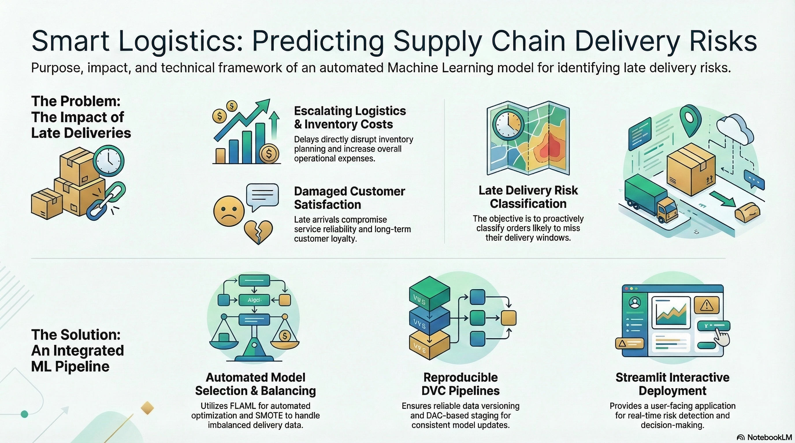

# Supply Chain Late Delivery Risk Prediction Model

The objective is to classify whether an order has a Late Delivery Risk (Late_delivery_risk).

## Project Structure:

SupplyChain_PredictionModel/
│
├── data/
│   └── raw/
│
├── dvc.yaml
├── params.yaml
├── best_model.pkl
├── preprocessor.pkl

├── automl.ipynb
├── flaml.log
├── streamlit_app.py (Streamlit)
└── main.py

